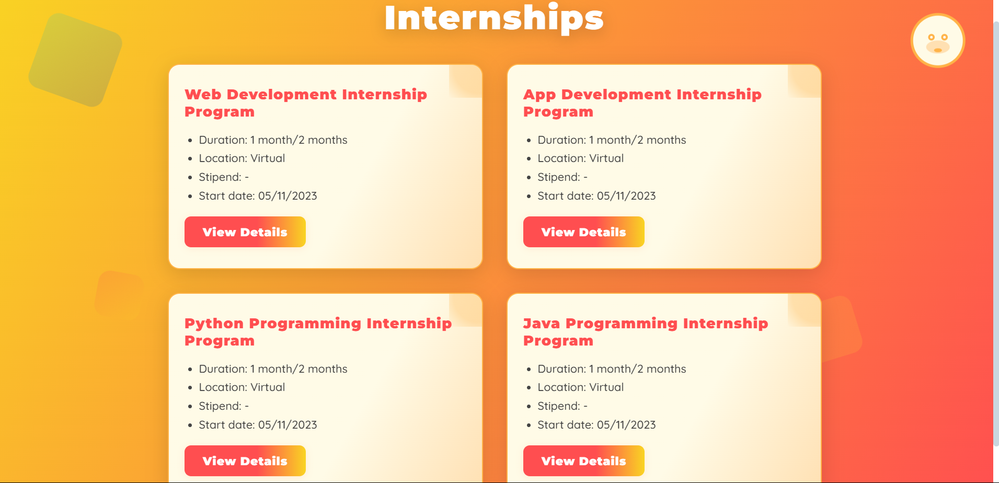

# Vault of Codes - Internship Programs Webpage

A visually engaging, animated web page showcasing internship programs at Vault of Codes.  
This project features animated SVG characters, floating decorative boxes, modern gradients, and attractive fonts for a delightful user experience.

## Features

- **Animated SVG Character:** Friendly mascot with blinking animation.
- **Floating Decorative Boxes:** Colorful, animated shapes for a lively background.
- **Modern UI:** Vibrant gradients, glassy cards, and smooth hover/fade-in effects.
- **Responsive Design:** Looks great on desktop and mobile.
- **Modal Popup:** Click "View Details" for more info in a stylish modal.

## Demo

 <!-- Add a screenshot if available -->

## Getting Started

1. **Clone the repository:**
   ```bash
   git clone https://github.com/yourusername/voc-internship-landing.git
   cd voc-internship-landing
   ```

2. **Open the project:**
   - Open `index.html` in your browser.

## Project Structure

```
.
├── index.html
├── style.css
├── script.js
└── README.md
```

## Customization

- **Add/Remove Internships:**  
  Edit the `.card` blocks in `index.html`.
- **Change Colors/Fonts:**  
  Tweak gradients and font families in `style.css`.
- **SVG Character:**  
  Replace or modify the SVG in the `.character` div.

## Technologies Used

- HTML5
- CSS3 (Flexbox, Grid, Animations)
- JavaScript (for modal interaction)
- Google Fonts (Montserrat, Quicksand, Poppins)

## License

This project is open source and available under the [MIT License](LICENSE).

---

**Made with ❤️ for Vault of
